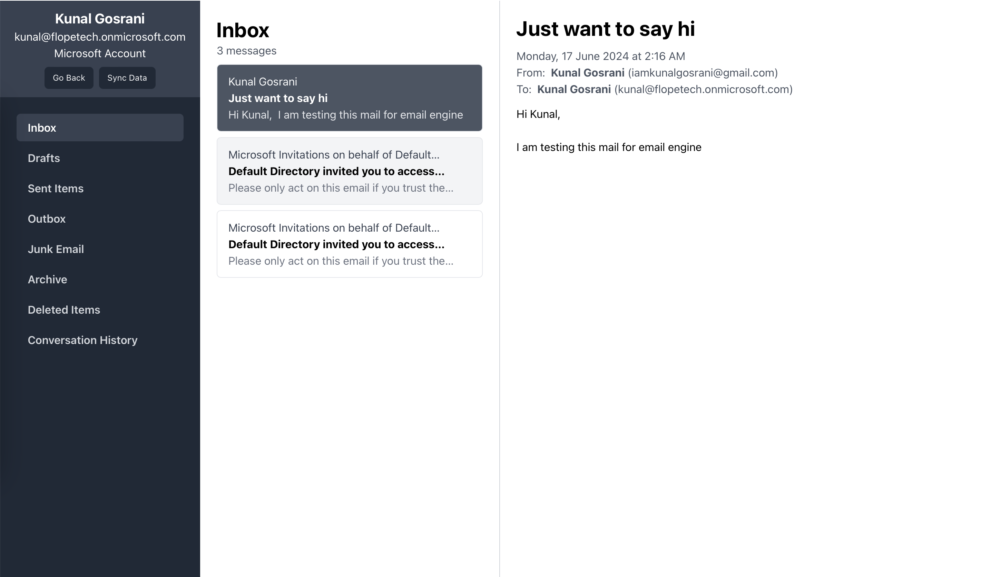

# Email Engine Core (Backend)

This is the backend repository for the Email Engine Core. It is built using the [NestJS](https://nestjs.com/) framework with [Elasticsearch](https://www.elastic.co/) for the database. <br />
Also checkout [Email Engine Core (Frontend) Repository](https://github.com/kunal-go/email-engine-frontend)



## Features

- Email client where you can link your multiple email accounts and view all your emails in one place.
- Right now, only Microsoft Outlook is supported.

## Setup and Installation

### Pre-requisites:

- Node.js (v18+)
- Pnpm package manager
- Docker Desktop

### Steps 1: Configure Microsoft Azure Account

- Create a new application in the [Microsoft Azure Portal](https://portal.azure.com/). You will need to create a new application and generate a client ID and client secret.
- Add the following redirect URL to your application: `http://localhost:5173/msal`
- Add the following permissions to your application:
  - `offline_access`
  - `User.Read`
  - `Mail.Read`
  - `Mail.ReadWrite`
  - `Mail.Send`
  - `Mail.Send.Shared`
  - `Mail.Read.Shared`
  - `Mail.ReadWrite.Shared`
- Note down the tenant ID of your application.
- Note down the client ID and client secret of your application.

### Steps 2: Set environment variables

create `.env` file in the root directory and add the following environment variables:

```javascript
NODE_ENV = 'development';
PORT '3000' // Port on which the server will run

ES_DB_HOST = 'http://localhost:9200';
ES_DB_PASSWORD // Set your password for elastic search docker instance

MS_GRAPH_CLIENT_ID // Your Microsoft Graph API client ID
MS_GRAPH_CLIENT_SECRET // Your Microsoft Graph API client secret
MS_GRAPH_REDIRECT_URI = 'http://localhost:5173/msal'; // Redirect URL of your web app
MS_GRAPH_TENANT_ID // Your Microsoft Graph API tenant ID
```

### Steps 3: Install project dependencies

```bash
$ pnpm install
```

### Steps 4: Start the Elasticsearch docker instance

```bash
$ pnpm docker:up
```

## Run the application

```bash
# development
$ pnpm start

# watch mode
$ pnpm start:dev

# production mode
$ pnpm start:prod
```

## License

[MIT licensed](LICENSE).
